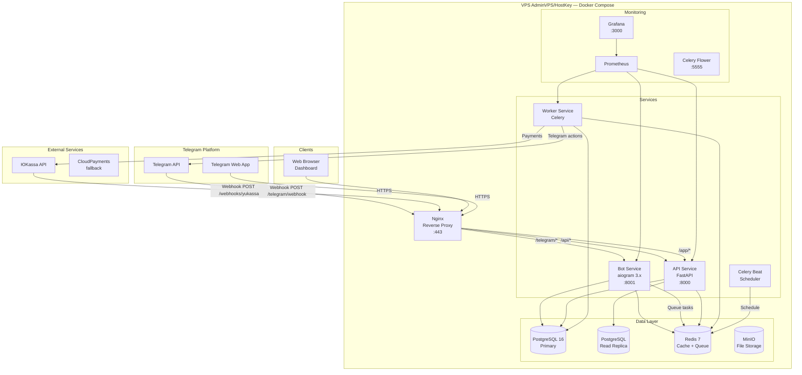
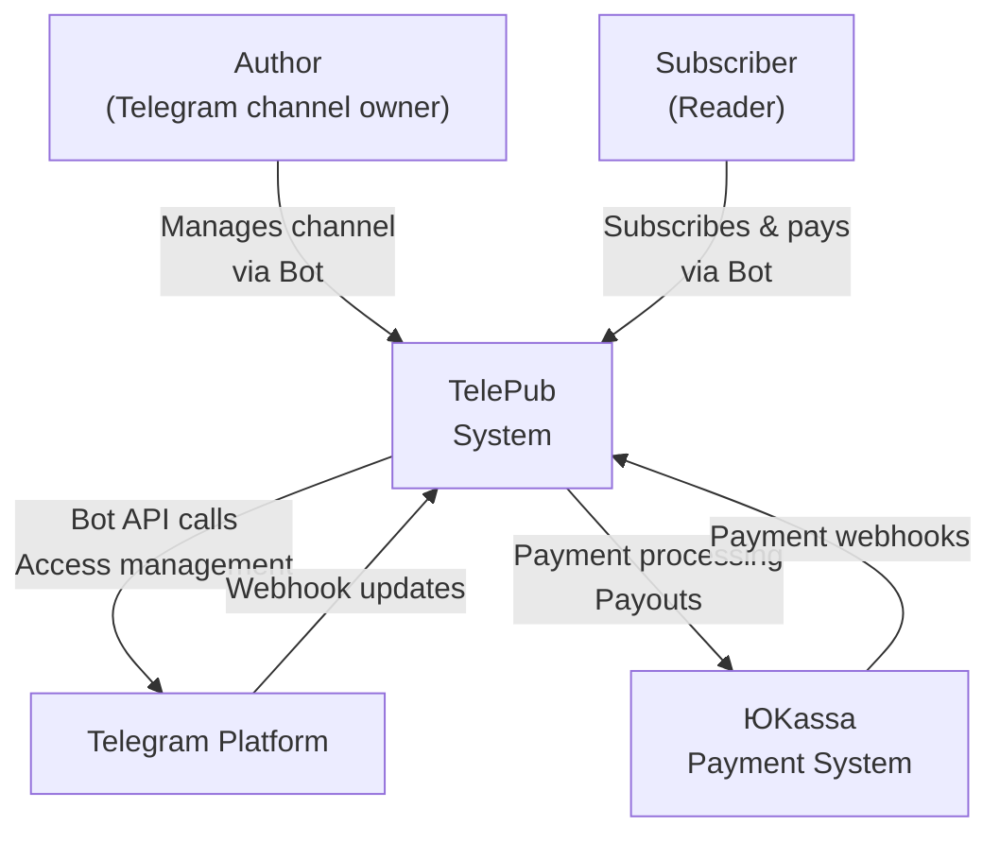
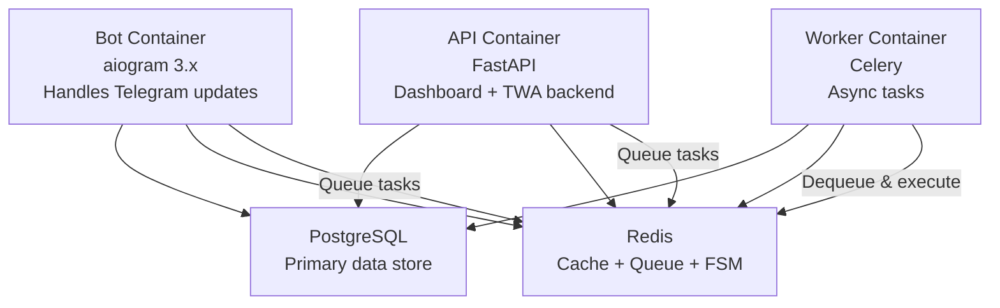

# Architecture: TelePub
**Дата:** 2026-04-22 | **Паттерн:** Distributed Monolith (Monorepo)

---

## 1. Architecture Overview

### Architecture Style
**Distributed Monolith в Monorepo** — единый репозиторий, несколько Docker-сервисов с чёткими границами доменов. Не микросервисы (слишком сложно для MVP), не монолит (нужна независимая масштабируемость bot workers).

### Rationale
- Bot workers должны масштабироваться независимо от API
- Celery workers — отдельный процесс для async задач
- Общая БД на старте (упрощает транзакции), domain separation через схемы PostgreSQL
- Один язык (Python) для bot + backend = меньше cognitive overhead

---

## 2. High-Level Diagram



---

## 3. Component Breakdown

### Bot Service (aiogram 3.x)
- **Responsibility:** Обработка всех Telegram update'ов через webhook
- **Stateless:** Состояние FSM хранится в Redis
- **Scale:** Горизонтальное масштабирование (несколько instances за Nginx)
- **Key libraries:** aiogram 3.x, aiogram-dialog, SQLAlchemy async, aioredis

### API Service (FastAPI)
- **Responsibility:** REST API для Web Dashboard + TWA + internal services
- **Auth:** JWT (HS256) на основе Telegram initData verification
- **Docs:** Auto-generated OpenAPI /docs (только в dev)
- **Scale:** Горизонтальное через uvicorn workers

### Worker Service (Celery)
- **Responsibility:** Все async задачи: платежи, доступ к каналам, уведомления, выплаты
- **Broker:** Redis
- **Result backend:** Redis
- **Queues:** critical (платежи), default (уведомления), low (аналитика)

### Celery Beat (Scheduler)
- **Responsibility:** Cron-задачи: ежедневный renewal processing, payouts, analytics aggregation
- **Instance:** Один (singleton)

---

## 4. Technology Stack

| Layer | Technology | Version | Rationale |
|-------|------------|---------|-----------|
| **Bot Framework** | aiogram | 3.x | Лучший async Telegram framework, FSM |
| **API Framework** | FastAPI | 0.115+ | Async, OpenAPI, типизация |
| **Task Queue** | Celery | 5.x | Mature, Redis broker, beat scheduler |
| **ORM** | SQLAlchemy | 2.0 (async) | Type-safe, миграции через Alembic |
| **Database** | PostgreSQL | 16 | Надёжность, JSONB, full-text search |
| **Cache/Queue** | Redis | 7 | FSM storage, Celery broker, rate limiting |
| **File Storage** | MinIO | latest | S3-compatible, self-hosted |
| **Web Frontend** | Next.js | 14 | SSR, TypeScript, Telegram TWA compatible |
| **Reverse Proxy** | Nginx | 1.25 | SSL termination, rate limiting, static |
| **Containerization** | Docker + Compose | latest | Единая среда dev/prod |
| **Monitoring** | Prometheus + Grafana | latest | Metrics, alerting |
| **Logging** | structlog + Loki | - | JSON structured logs |
| **Payment** | ЮKassa Python SDK | latest | Primary payment provider |

---

## 5. Data Architecture

### Database Schema Layout

```sql
-- Схема: core
CREATE SCHEMA core;

-- Authors
CREATE TABLE core.authors (
    id UUID PRIMARY KEY DEFAULT gen_random_uuid(),
    telegram_user_id BIGINT UNIQUE NOT NULL,
    username VARCHAR(255),
    yukassa_shop_id VARCHAR(255),
    yukassa_account_id VARCHAR(255),
    balance_rub DECIMAL(12,2) DEFAULT 0,
    payout_method JSONB,          -- токенизированные данные карты
    verified BOOLEAN DEFAULT FALSE,
    created_at TIMESTAMPTZ DEFAULT NOW()
);

-- Channels
CREATE TABLE core.channels (
    id UUID PRIMARY KEY DEFAULT gen_random_uuid(),
    author_id UUID REFERENCES core.authors(id),
    telegram_channel_id BIGINT UNIQUE NOT NULL,
    telegram_invite_link TEXT,
    title VARCHAR(255) NOT NULL,
    description TEXT,
    status VARCHAR(20) DEFAULT 'active',
    created_at TIMESTAMPTZ DEFAULT NOW()
);

-- Subscription Plans
CREATE TABLE core.subscription_plans (
    id UUID PRIMARY KEY DEFAULT gen_random_uuid(),
    channel_id UUID REFERENCES core.channels(id),
    price_rub DECIMAL(10,2) NOT NULL,
    billing_interval VARCHAR(20) DEFAULT 'monthly',
    trial_days INT DEFAULT 0,
    is_active BOOLEAN DEFAULT TRUE
);

-- Subscriptions
CREATE TABLE core.subscriptions (
    id UUID PRIMARY KEY DEFAULT gen_random_uuid(),
    subscriber_telegram_id BIGINT NOT NULL,
    plan_id UUID REFERENCES core.subscription_plans(id),
    status VARCHAR(20) DEFAULT 'pending',
    yukassa_payment_method_id VARCHAR(255),
    started_at TIMESTAMPTZ,
    expires_at TIMESTAMPTZ,
    grace_expires_at TIMESTAMPTZ,
    cancelled_at TIMESTAMPTZ,
    created_at TIMESTAMPTZ DEFAULT NOW()
);

-- Payments (idempotent)
CREATE TABLE core.payments (
    id UUID PRIMARY KEY,              -- = idempotency_key
    subscription_id UUID REFERENCES core.subscriptions(id),
    amount_rub DECIMAL(10,2) NOT NULL,
    platform_fee_rub DECIMAL(10,2) DEFAULT 0,
    yukassa_fee_rub DECIMAL(10,2) DEFAULT 0,
    net_to_author_rub DECIMAL(10,2),
    status VARCHAR(20) DEFAULT 'pending',
    yukassa_payment_id VARCHAR(255),
    created_at TIMESTAMPTZ DEFAULT NOW()
);

-- Payouts
CREATE TABLE core.payouts (
    id UUID PRIMARY KEY DEFAULT gen_random_uuid(),
    author_id UUID REFERENCES core.authors(id),
    amount_rub DECIMAL(12,2) NOT NULL,
    status VARCHAR(20) DEFAULT 'pending',
    yukassa_payout_id VARCHAR(255),
    created_at TIMESTAMPTZ DEFAULT NOW()
);

-- Indexes
CREATE INDEX idx_subscriptions_expires ON core.subscriptions(expires_at) WHERE status = 'active';
CREATE INDEX idx_subscriptions_subscriber ON core.subscriptions(subscriber_telegram_id);
CREATE INDEX idx_payments_yukassa_id ON core.payments(yukassa_payment_id);
```

### Read Replica Usage
- Analytics queries → replica
- Dashboard data → replica
- Writes (payments, subscriptions) → primary

---

## 6. Security Architecture

### Authentication & Authorization

```
Telegram Bot → User identified by telegram_user_id (verified by Telegram)
Web Dashboard → JWT token (HS256, 24h expiry)
  JWT payload: { user_id, telegram_user_id, channels: [channel_ids] }
  Generated from: Telegram initData hash verification (HMAC-SHA256)
TWA → Same JWT, initData passed from Telegram client
API internal → Service tokens in Docker secrets
```

### Payment Security
- Данные карт: только через ЮKassa hosted page (мы НИКОГДА не видим данные карты)
- Webhook verification: HMAC-SHA256 с YUKASSA_SECRET
- Idempotency: все платёжные операции имеют idempotency_key
- Payout verification: double-confirmation через Telegram для сумм > 50K руб

### Infrastructure Security
- Nginx: rate limiting, DDoS basic protection
- PostgreSQL: только внутренняя сеть Docker, не exposed
- Redis: AUTH пароль, только внутренняя сеть
- Bot token: Docker secrets, не в env файлах репозитория
- SSL: Let's Encrypt через Nginx

---

## 7. Deployment Architecture

```
Internet → DNS (telepub.ru) → VPS IP
VPS → Docker Compose network "telepub_net"

Nginx (port 443/80) → routes:
  /telegram/webhook → bot:8001
  /webhooks/* → api:8000
  /api/* → api:8000
  /app/* → api:8000 (serves Next.js SSR)
  / → api:8000 (marketing landing)
```

### Docker Compose Services

```yaml
services:
  nginx, bot, api, worker, beat,
  postgres, postgres_replica, redis, minio,
  prometheus, grafana, flower
```

---

## 8. Scalability Considerations

### MVP (до 10K активных подписок)
- Single VPS, все сервисы на одной машине
- PostgreSQL без replica (добавить в v1.0)
- Redis single instance

### v1.0 (до 100K активных подписок)
- Bot: 3 replicas за Nginx (round-robin)
- API: 2 replicas
- PostgreSQL + 1 read replica (streaming replication)
- Celery workers: critical queue × 3, default × 2

### v2.0 (500K+)
- Отдельные VPS для: DB, Redis, Bot+API
- Database connection pooling через PgBouncer
- Redis Sentinel или Cluster

---

## 9. C4 Diagrams

### C4 Level 1: System Context


### MCP Server Integration (AI Analytics)

```
TelePub API ←→ MCP Server (telepub-analytics-mcp)
                    ↓
              Claude API (claude-sonnet-4-6)
                    ↓
              AI Insights Generation:
              - "Лучшее время для публикации: вторник 19:00-21:00"
              - "Прогноз оттока: 15% подписчиков в следующие 30 дней"
              - "Темы с наибольшим вовлечением: финансовые кейсы, разборы"
```

MCP tools exposed:
- `get_channel_stats(channel_id, period)` → raw metrics
- `get_top_posts(channel_id, limit)` → engagement data
- `predict_churn(channel_id)` → ML-based churn risk

### C4 Level 2: Container Diagram

