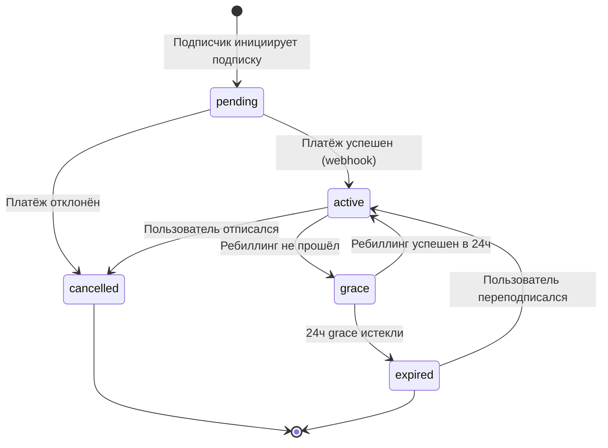

# Pseudocode: TelePub
**Дата:** 2026-04-22

---

## 1. Data Structures

```typescript
type Author = {
  id: UUID
  telegram_user_id: Int64
  username: String | null
  yukassa_account_id: String | null
  yukassa_shop_id: String | null
  balance_rub: Decimal
  created_at: Timestamp
  verified: Boolean
}

type Channel = {
  id: UUID
  author_id: UUID         // FK → Author
  telegram_channel_id: Int64
  telegram_invite_link: String
  title: String
  description: String | null
  status: "active" | "paused" | "suspended"
  created_at: Timestamp
}

type SubscriptionPlan = {
  id: UUID
  channel_id: UUID
  price_rub: Decimal       // минимум 100 руб
  billing_interval: "monthly" | "annual"
  trial_days: Int          // 0 = без триала
  is_active: Boolean
}

type Subscription = {
  id: UUID
  subscriber_telegram_id: Int64
  plan_id: UUID
  status: "active" | "grace" | "expired" | "cancelled"
  yukassa_payment_method_id: String | null
  started_at: Timestamp
  expires_at: Timestamp
  cancelled_at: Timestamp | null
}

type Payment = {
  id: UUID                 // = idempotency_key
  subscription_id: UUID
  amount_rub: Decimal
  platform_fee_rub: Decimal
  yukassa_fee_rub: Decimal
  net_to_author_rub: Decimal
  status: "pending" | "success" | "failed" | "refunded"
  yukassa_payment_id: String | null
  created_at: Timestamp
}

type Payout = {
  id: UUID
  author_id: UUID
  amount_rub: Decimal
  status: "pending" | "processing" | "completed" | "failed"
  yukassa_payout_id: String | null
  created_at: Timestamp
}
```

---

## 2. Core Algorithms

### Algorithm: Author Registration FSM

```
FSM States: idle → awaiting_channel → awaiting_bot_admin → awaiting_yukassa → complete

FUNCTION handle_registration_start(telegram_user_id):
  state = fsm.get_state(telegram_user_id)
  IF state is None:
    fsm.set_state(telegram_user_id, "awaiting_channel")
    bot.send_message(telegram_user_id,
      "👋 Добро пожаловать в TelePub!\n\n"
      "Отправьте @username вашего Telegram-канала:"
    )

FUNCTION handle_channel_input(telegram_user_id, channel_username):
  STATE: awaiting_channel
  
  channel = telegram_api.get_chat(channel_username)
  IF channel is None OR channel.type != "channel":
    bot.send_message(telegram_user_id, "❌ Канал не найден. Попробуйте ещё раз.")
    RETURN
  
  member = telegram_api.get_chat_member(channel.id, telegram_user_id)
  IF member.status NOT IN ["creator", "administrator"]:
    bot.send_message(telegram_user_id, "❌ Вы не являетесь администратором этого канала.")
    RETURN
  
  fsm.set_data(telegram_user_id, {"channel_id": channel.id, "channel_title": channel.title})
  fsm.set_state(telegram_user_id, "awaiting_bot_admin")
  bot.send_message(telegram_user_id,
    f"✅ Канал '{channel.title}' найден.\n\n"
    "Добавьте @TelePubBot как администратора с правами:\n"
    "• Пригласить пользователей\n• Удалить участников\n\n"
    "Нажмите 'Проверить' когда готово.",
    reply_markup=InlineKeyboard("Проверить ✅", callback="check_bot_rights")
  )

FUNCTION handle_check_bot_rights(telegram_user_id):
  STATE: awaiting_bot_admin
  
  data = fsm.get_data(telegram_user_id)
  channel_id = data["channel_id"]
  
  bot_member = telegram_api.get_chat_member(channel_id, BOT_USER_ID)
  IF bot_member.status != "administrator":
    bot.send_message(telegram_user_id, "❌ Бот не добавлен как администратор. Попробуйте ещё раз.")
    RETURN
  IF NOT (bot_member.can_invite_users AND bot_member.can_restrict_members):
    bot.send_message(telegram_user_id, "❌ Недостаточно прав. Нужны: Пригласить + Удалить участников.")
    RETURN
  
  // Создать закрытый канал или получить invite link
  invite_link = telegram_api.create_chat_invite_link(channel_id, creates_join_request=False)
  
  // Сохранить канал в БД
  channel = db.channels.create(
    author_id=db.authors.get_or_create(telegram_user_id).id,
    telegram_channel_id=channel_id,
    telegram_invite_link=invite_link,
    title=data["channel_title"]
  )
  fsm.set_data(telegram_user_id, {**data, "db_channel_id": channel.id})
  
  // Запросить настройку подписки
  fsm.set_state(telegram_user_id, "awaiting_plan_setup")
  bot.send_message(telegram_user_id,
    "💰 Установите цену подписки (в рублях/месяц):\n"
    "Минимум: 100 руб | Рекомендуем: 300-500 руб"
  )

FUNCTION handle_plan_price_input(telegram_user_id, price_text):
  STATE: awaiting_plan_setup
  
  TRY:
    price = Decimal(price_text)
  EXCEPT:
    bot.send_message(telegram_user_id, "❌ Введите число. Например: 299")
    RETURN
  
  IF price < 100:
    bot.send_message(telegram_user_id, "❌ Минимальная цена — 100 руб.")
    RETURN
  
  data = fsm.get_data(telegram_user_id)
  plan = db.subscription_plans.create(
    channel_id=data["db_channel_id"],
    price_rub=price,
    billing_interval="monthly"
  )
  
  fsm.set_state(telegram_user_id, "awaiting_yukassa")
  yukassa_oauth_url = generate_yukassa_oauth_url(telegram_user_id)
  
  bot.send_message(telegram_user_id,
    f"✅ Цена установлена: {price} руб/мес\n\n"
    "Последний шаг — подключите ЮKassa для получения платежей:",
    reply_markup=InlineKeyboard("Подключить ЮKassa 💳", url=yukassa_oauth_url)
  )

FUNCTION handle_yukassa_oauth_callback(telegram_user_id, shop_id, secret_key):
  // Вызывается после OAuth redirect от ЮKassa
  author = db.authors.get(telegram_user_id=telegram_user_id)
  author.yukassa_shop_id = shop_id
  author.yukassa_account_id = generate_account_id()
  author.verified = True
  db.save(author)
  
  data = fsm.get_data(telegram_user_id)
  subscribe_link = f"https://t.me/TelePubBot?start=channel_{data['db_channel_id']}"
  
  fsm.clear(telegram_user_id)
  bot.send_message(telegram_user_id,
    f"🎉 Всё готово! Ваш канал подключён к TelePub.\n\n"
    f"Ссылка для подписчиков:\n{subscribe_link}\n\n"
    "Поделитесь ей с аудиторией 🚀"
  )
```

### Algorithm: Analytics Aggregation

```
FUNCTION aggregate_channel_analytics(channel_id, period_days=30):
  INPUT: channel_id: UUID, period_days: Int
  OUTPUT: AnalyticsSnapshot

  period_start = NOW() - period_days days

  // MRR расчёт
  active_subs = db.subscriptions.filter(
    channel.id=channel_id, status="active"
  )
  mrr = SUM(sub.plan.price_rub for sub in active_subs)

  // Новые и отписавшиеся за период
  new_subs = db.subscriptions.filter(
    channel.id=channel_id,
    started_at__gte=period_start,
    status__in=["active", "expired", "cancelled"]
  ).count()

  churned_subs = db.subscriptions.filter(
    channel.id=channel_id,
    cancelled_at__gte=period_start
  ).count() + db.subscriptions.filter(
    channel.id=channel_id,
    status="expired",
    expires_at__gte=period_start
  ).count()

  // ARPU
  arpu = mrr / active_subs.count() IF active_subs.count() > 0 ELSE 0

  // LTV estimate: ARPU / churn_rate
  monthly_churn_rate = churned_subs / (active_subs.count() + churned_subs) IF total > 0 ELSE 0.05
  ltv_estimate = (arpu / monthly_churn_rate) IF monthly_churn_rate > 0 ELSE arpu * 24

  // MRR trend (сравнение с предыдущим периодом)
  prev_mrr = calculate_mrr_at_date(channel_id, NOW() - period_days days)
  mrr_trend_pct = ((mrr - prev_mrr) / prev_mrr * 100) IF prev_mrr > 0 ELSE 0

  RETURN AnalyticsSnapshot(
    mrr=mrr,
    mrr_trend_pct=mrr_trend_pct,
    active_subscribers=active_subs.count(),
    new_subscribers=new_subs,
    churned_subscribers=churned_subs,
    arpu=arpu,
    ltv_estimate=ltv_estimate
  )

// Кэширование: результат кэшируется в Redis на 1 час
// Cache key: f"analytics:{channel_id}:{period_days}"
```


### Algorithm: Calculate Platform Fee

```
FUNCTION calculate_platform_fee(payment_amount_rub, author_monthly_revenue_rub):
  INPUT: payment_amount_rub: Decimal, author_monthly_revenue_rub: Decimal
  OUTPUT: platform_fee_rub: Decimal

  THRESHOLD = 10_000  // руб/мес

  IF author_monthly_revenue_rub <= THRESHOLD:
    platform_fee_rate = 0.00   // 0% для новых авторов
  ELSE:
    platform_fee_rate = 0.05   // 5% после порога

  yukassa_fee = payment_amount_rub * 0.028 + 15  // ЮKassa тариф
  platform_fee = payment_amount_rub * platform_fee_rate
  net_to_author = payment_amount_rub - platform_fee - yukassa_fee

  RETURN platform_fee
```

### Algorithm: Process Subscription Payment (Webhook Handler)

```
FUNCTION handle_yukassa_webhook(webhook_payload, hmac_signature):
  INPUT: webhook_payload: JSON, hmac_signature: String
  OUTPUT: HTTP 200 | HTTP 400

  // 1. Verify authenticity
  IF NOT verify_hmac(webhook_payload, hmac_signature, YUKASSA_SECRET):
    RETURN HTTP 400, "Invalid signature"

  payment_id = webhook_payload.object.id
  status = webhook_payload.object.status
  metadata = webhook_payload.object.metadata

  // 2. Idempotency check
  existing = db.payments.find_by(yukassa_payment_id=payment_id)
  IF existing AND existing.status == "success":
    RETURN HTTP 200, "Already processed"  // Идемпотентность

  // 3. Process by status
  IF status == "succeeded":
    subscription_id = metadata.subscription_id
    subscription = db.subscriptions.find(subscription_id)
    
    // Update subscription
    subscription.status = "active"
    subscription.expires_at = NOW() + 30 days
    subscription.yukassa_payment_method_id = webhook_payload.object.payment_method.id
    db.save(subscription)
    
    // Record payment
    payment = db.payments.find_by(id=metadata.idempotency_key)
    payment.status = "success"
    payment.yukassa_payment_id = payment_id
    db.save(payment)
    
    // Credit author balance
    author = db.authors.find_by_channel(subscription.plan.channel_id)
    fee = calculate_platform_fee(payment.amount_rub, get_author_monthly_revenue(author.id))
    author.balance_rub += (payment.amount_rub - fee - payment.yukassa_fee_rub)
    db.save(author)
    
    // Grant Telegram access
    tasks.queue(grant_channel_access, subscriber_id=subscription.subscriber_telegram_id,
                channel_id=subscription.plan.channel.telegram_channel_id)
    
    // Notify
    tasks.queue(notify_subscriber_payment_success, subscription.subscriber_telegram_id)
    tasks.queue(notify_author_new_subscriber, author.telegram_user_id, subscription)
    
  ELSE IF status == "canceled":
    // Handle failed payment
    subscription = db.subscriptions.find(metadata.subscription_id)
    IF subscription.status == "active":
      subscription.status = "grace"
      subscription.grace_expires_at = NOW() + 24 hours
      db.save(subscription)
      tasks.queue(notify_subscriber_payment_failed, subscription.subscriber_telegram_id)

  RETURN HTTP 200, "OK"
```

### Algorithm: Grant/Revoke Channel Access

```
FUNCTION grant_channel_access(subscriber_telegram_id, telegram_channel_id):
  INPUT: subscriber_telegram_id: Int64, telegram_channel_id: Int64
  OUTPUT: success: Boolean

  TRY:
    invite_link = telegram_api.create_chat_invite_link(
      chat_id=telegram_channel_id,
      member_limit=1,
      expire_date=NOW() + 1 hour
    )
    telegram_bot.send_message(
      chat_id=subscriber_telegram_id,
      text="✅ Оплата прошла! Вступайте в канал:",
      reply_markup=InlineKeyboardButton("Перейти в канал", url=invite_link)
    )
    RETURN True
  EXCEPT TelegramAPIError as e:
    log.error("Failed to grant access", error=e)
    tasks.retry(grant_channel_access, delay=60)  // Retry через 1 минуту
    RETURN False


FUNCTION revoke_channel_access(subscriber_telegram_id, telegram_channel_id):
  INPUT: subscriber_telegram_id: Int64, telegram_channel_id: Int64

  TRY:
    telegram_api.ban_chat_member(
      chat_id=telegram_channel_id,
      user_id=subscriber_telegram_id
    )
    // Сразу разбанить чтобы дать возможность переподписаться
    telegram_api.unban_chat_member(
      chat_id=telegram_channel_id,
      user_id=subscriber_telegram_id,
      only_if_banned=True
    )
  EXCEPT UserNotFound:
    PASS  // Уже не в канале, ок
```

### Algorithm: Daily Renewal Processing

```
FUNCTION process_daily_renewals():
  // Запускается каждый день в 09:00 MSK через Celery Beat

  // 1. Найти подписки истекающие в следующие 3 дня → уведомить
  upcoming = db.subscriptions.filter(
    status="active",
    expires_at__range=(NOW(), NOW() + 3 days)
  )
  FOR subscription IN upcoming:
    IF NOT already_notified_today(subscription):
      tasks.queue(notify_renewal_upcoming, subscription)

  // 2. Попытаться автоматически продлить истекающие сегодня
  expiring = db.subscriptions.filter(
    status="active",
    expires_at__lte=NOW()
  )
  FOR subscription IN expiring:
    IF subscription.yukassa_payment_method_id:
      tasks.queue(attempt_renewal_charge, subscription.id)
    ELSE:
      subscription.status = "expired"
      db.save(subscription)
      tasks.queue(revoke_channel_access,
                  subscription.subscriber_telegram_id,
                  subscription.plan.channel.telegram_channel_id)

  // 3. Истечение grace period
  grace_expired = db.subscriptions.filter(
    status="grace",
    grace_expires_at__lte=NOW()
  )
  FOR subscription IN grace_expired:
    subscription.status = "expired"
    db.save(subscription)
    tasks.queue(revoke_channel_access, ...)
    tasks.queue(notify_subscriber_expired, subscription)


FUNCTION attempt_renewal_charge(subscription_id):
  subscription = db.subscriptions.find(subscription_id)
  idempotency_key = generate_uuid()  // NEW key для повторного платежа

  payment_result = yukassa_api.create_payment(
    amount=subscription.plan.price_rub,
    payment_method_id=subscription.yukassa_payment_method_id,
    capture=True,
    idempotency_key=idempotency_key,
    metadata={"subscription_id": subscription_id, "idempotency_key": idempotency_key}
  )

  // Результат придёт через webhook — handle_yukassa_webhook
```

### Algorithm: Daily Author Payouts

```
FUNCTION process_daily_payouts():
  // Запускается каждый день в 10:00 MSK

  authors_with_balance = db.authors.filter(
    balance_rub__gte=1000,
    yukassa_account_id__is_not_null=True,
    verified=True
  )

  FOR author IN authors_with_balance:
    payout = db.payouts.create(
      author_id=author.id,
      amount_rub=author.balance_rub,
      status="pending"
    )

    TRY:
      result = yukassa_api.create_payout(
        amount=author.balance_rub,
        payout_destination_data={
          "type": "bank_card",  // или yukassa_account
          "card": {"number": author.payout_card_last4}  // токенизированные данные
        },
        description=f"TelePub выплата {date.today()}"
      )
      payout.yukassa_payout_id = result.id
      payout.status = "processing"
      author.balance_rub = 0
      db.save(payout, author)
      tasks.queue(notify_author_payout_initiated, author.telegram_user_id, payout.amount_rub)

    EXCEPT YuKassaError as e:
      payout.status = "failed"
      db.save(payout)
      log.error("Payout failed", author_id=author.id, error=e)
      tasks.queue(notify_author_payout_failed, author.telegram_user_id)
```

---

## 3. API Contracts

### POST /api/webhooks/yukassa
```
Headers:
  X-Request-Id: String (idempotency)
  Content-Type: application/json

Body: YuKassaWebhookPayload (see YuKassa docs)

Response 200: { "status": "ok" }
Response 400: { "error": "invalid_signature" }
```

### POST /api/webhooks/telegram
```
Headers:
  X-Telegram-Bot-Api-Secret-Token: String

Body: Telegram Update object

Response 200: {} (always 200, errors logged internally)
```

### GET /api/dashboard/channels/{channel_id}/analytics
```
Auth: Bearer JWT (telegram_user_id verified)

Query params:
  period: "7d" | "30d" | "90d" (default: "30d")

Response 200:
{
  "mrr": { "current": Decimal, "trend_pct": Float },
  "subscribers": { "active": Int, "new": Int, "churned": Int },
  "arpu": Decimal,
  "ltv_estimate": Decimal,
  "top_posts": [{ "post_id": Int, "views": Int, "reactions": Int }]
}

Response 403: { "error": "not_channel_owner" }
```

### POST /api/channels/{channel_id}/payouts/manual
```
Auth: Bearer JWT

Response 200: { "payout_id": UUID, "amount": Decimal, "status": "pending" }
Response 400: { "error": "balance_too_low", "minimum": 1000 }
Response 429: { "error": "payout_already_today" }
```

---

## 4. State Transitions



---

## 5. Error Handling Strategy

| Категория | Пример | Стратегия |
|-----------|--------|-----------|
| Telegram API 429 | Rate limit | Exponential backoff: 1s → 2s → 4s → 8s (max 5 попыток) |
| Telegram API 400 | Bot не admin | Уведомить автора, логировать, не ретраить |
| ЮKassa timeout | Оплата завис | Webhook придёт async — ждать, не дублировать платёж |
| DB connection error | PostgreSQL недоступен | Circuit breaker, graceful degradation, retry |
| Payment webhook missing | Не пришёл за 10 мин | Reconciliation job: сверить с ЮKassa API |
| Invalid webhook HMAC | Потенциальная атака | 400 + лог + rate limit IP |
